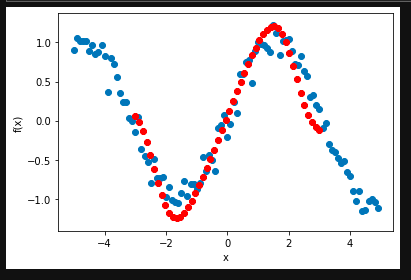

# FinTech-Time-Series
Quantum Machine Learning for [FinTech](https://towardsdatascience.com/ten-applications-of-ai-to-fintech-22d626c2fdac) and Time Series Data

## [Quantum Neural Networks for FinTech](https://eandt.theiet.org/content/articles/2019/04/quantum-on-the-money-fintech-is-banking-on-the-future-of-computing/) Time Series Function Fitting
This repository is for developing quantum neural network models for fitting one-dimensional time series data and noisy signals. It is modified from the model presented in PennyLane [Function fitting with a quantum neural network](https://pennylane.ai/qml/app/quantum_neural_net.html). We modify the code presented in the default notebook downloaded from PennyLane so that it works using synthetic data created by the user, and we train a model on several years worth of drug sales data. 


## Training Data
In this very basic setup, there were only 4-layers in the quantum neural network, initialized with random weights. The model went through 50 iterations and had the following training data:

```
Iter:     1 | Cost: 0.4366430 
Iter:     2 | Cost: 0.4130995 
Iter:     3 | Cost: 0.4401763 
Iter:     4 | Cost: 0.4843044 
Iter:     5 | Cost: 0.5272264 
Iter:     6 | Cost: 0.5590949 
Iter:     7 | Cost: 0.5756194 
Iter:     8 | Cost: 0.5762956 
Iter:     9 | Cost: 0.5631025 
Iter:    10 | Cost: 0.5394853 
Iter:    11 | Cost: 0.5095363 
Iter:    12 | Cost: 0.4773198 
Iter:    13 | Cost: 0.4463337 
Iter:    14 | Cost: 0.4191397 
Iter:    15 | Cost: 0.3972019 
Iter:    16 | Cost: 0.3809405 
Iter:    17 | Cost: 0.3699549 
Iter:    18 | Cost: 0.3633300 
Iter:    19 | Cost: 0.3599337 
Iter:    20 | Cost: 0.3586456 
Iter:    21 | Cost: 0.3584964 
Iter:    22 | Cost: 0.3587285 
Iter:    23 | Cost: 0.3588033 
Iter:    24 | Cost: 0.3583769 
Iter:    25 | Cost: 0.3572647 
Iter:    26 | Cost: 0.3554029 
Iter:    27 | Cost: 0.3528146 
Iter:    28 | Cost: 0.3495813 
Iter:    29 | Cost: 0.3458197 
Iter:    30 | Cost: 0.3416648 
Iter:    31 | Cost: 0.3372562 
Iter:    32 | Cost: 0.3327294 
Iter:    33 | Cost: 0.3282081 
Iter:    34 | Cost: 0.3238007 
Iter:    35 | Cost: 0.3195972 
Iter:    36 | Cost: 0.3156676 
Iter:    37 | Cost: 0.3120615 
Iter:    38 | Cost: 0.3088088 
Iter:    39 | Cost: 0.3059200 
Iter:    40 | Cost: 0.3033888 
Iter:    41 | Cost: 0.3011936 
Iter:    42 | Cost: 0.2993004 
Iter:    43 | Cost: 0.2976666 
Iter:    44 | Cost: 0.2962437 
Iter:    45 | Cost: 0.2949811 
Iter:    46 | Cost: 0.2938298 
Iter:    47 | Cost: 0.2927447 
Iter:    48 | Cost: 0.2916878 
Iter:    49 | Cost: 0.2906292 
Iter:    50 | Cost: 0.2895481 
Iter:    51 | Cost: 0.2884328 
Iter:    52 | Cost: 0.2872799 
Iter:    53 | Cost: 0.2860931 
Iter:    54 | Cost: 0.2848812 
Iter:    55 | Cost: 0.2836566 
Iter:    56 | Cost: 0.2824333 
Iter:    57 | Cost: 0.2812253 
Iter:    58 | Cost: 0.2800452 
Iter:    59 | Cost: 0.2789039 
Iter:    60 | Cost: 0.2778094 
Iter:    61 | Cost: 0.2767668 
Iter:    62 | Cost: 0.2757787 
Iter:    63 | Cost: 0.2748451 
Iter:    64 | Cost: 0.2739643 
Iter:    65 | Cost: 0.2731328 
Iter:    66 | Cost: 0.2723465 
Iter:    67 | Cost: 0.2716004 
Iter:    68 | Cost: 0.2708895 
Iter:    69 | Cost: 0.2702092 
Iter:    70 | Cost: 0.2695549 
Iter:    71 | Cost: 0.2689228 
Iter:    72 | Cost: 0.2683099 
Iter:    73 | Cost: 0.2677134 
Iter:    74 | Cost: 0.2671316 
Iter:    75 | Cost: 0.2665631 
Iter:    76 | Cost: 0.2660070 
Iter:    77 | Cost: 0.2654630 
Iter:    78 | Cost: 0.2649310 
Iter:    79 | Cost: 0.2644110 
Iter:    80 | Cost: 0.2639034 
Iter:    81 | Cost: 0.2634083 
Iter:    82 | Cost: 0.2629260 
Iter:    83 | Cost: 0.2624569 
Iter:    84 | Cost: 0.2620009 
Iter:    85 | Cost: 0.2615582 
Iter:    86 | Cost: 0.2611285 
Iter:    87 | Cost: 0.2607117 
Iter:    88 | Cost: 0.2603074 
Iter:    89 | Cost: 0.2599152 
Iter:    90 | Cost: 0.2595346 
Iter:    91 | Cost: 0.2591651 
Iter:    92 | Cost: 0.2588059 
Iter:    93 | Cost: 0.2584567 
Iter:    94 | Cost: 0.2581168 
Iter:    95 | Cost: 0.2577857 
Iter:    96 | Cost: 0.2574629 
Iter:    97 | Cost: 0.2571479 
Iter:    98 | Cost: 0.2568405 
Iter:    99 | Cost: 0.2565402 
Iter:   100 | Cost: 0.2562468 
```

## Prediction Plots
After training the quantum neural network learns to smooth the noisy sine function as can be seen in the red plots:



In later examples of applications of quantum machine learning to FinTech, we will also be investigating [quantum walks](https://link.medium.com/ZsbIWYMAL2). [Quantum walks](https://fintechcircle.com/insights/quantum-machine-learning/) are a quantum analogue to random walks and have substantially reduced the time-consumption in Monte Carlo simulations for mixing of Markov chains as reported by Ashley Montanaro (2015). [These quantum algorithms](https://advances.sciencemag.org/content/4/5/eaat3174.full) are applied for investment strategies in wealth management and trading.
